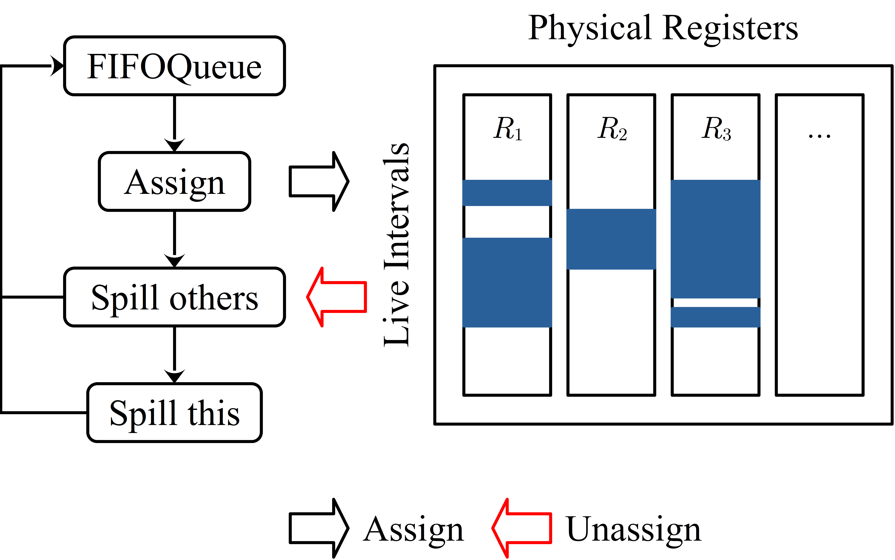
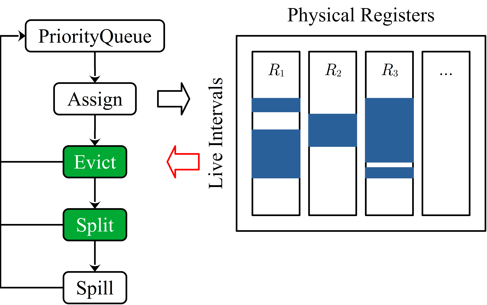

# Tutorial 7 Register Allocation

**Handout**: [\[Overleaf\]](https://www.overleaf.com/read/bjrphznfydcg)

## TL'DR

<table>
  <tr>
  <th>

RAMinimal

  </th>
  <th>
  
RAGreedy
  
  </th>
  </tr>
  <tr>
  <td>



  </td>
  <td>
  

  
  </td>
  </tr>
</table>

- x86 Registers
  - Register Overlapping
  - Caller- vs. Callee-Saved Registers

## Examples

The example shows you how to build a minimal register allocator that goes
through the list of live intervals and materialize them whenever there are
physical registers available. If none is available then the interval is spilled.
```
$ mkdir build && cd build
$ cmake -DCMAKE_BUILD_TYPE=Release ..
$ make
$ ctest -V
```
